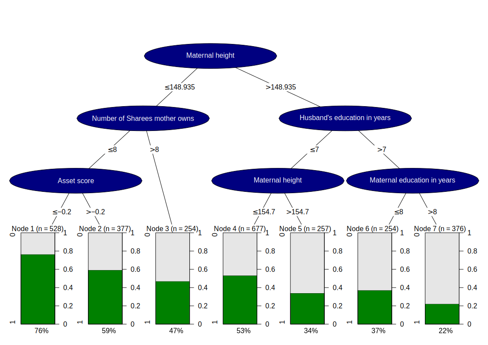
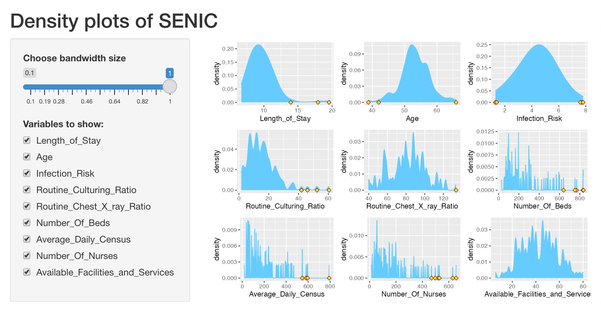

```{r setup, include=FALSE}
knitr::opts_chunk$set(echo = TRUE)
library(plotly)
library(ggplot2)
library(gridExtra)
library(shiny)
```

#### Statement Of Contribution
- Programming and Inkscape processing: Siyu Liu
- Analysis: Shipeng Liu

## Assignment 1
```{r fig.align="center", fig.cap=c(""), echo=FALSE}

```

## Assignment 2

### 1. Read data from SENIC.txt into R
```{r}
senicData <- data.frame(read.table("SENIC.txt"))
```
```{r echo=FALSE}
colNames <- c("ID", 
              "Length_of_Stay", 
              "Age", 
              "Infection_Risk", 
              "Routine_Culturing_Ratio", 
              "Routine_Chest_X_ray_Ratio",
              "Number_Of_Beds",
              "Medical_School_Affiliation",
              "Region",
              "Average_Daily_Census", 
              "Number_Of_Nurses",
              "Available_Facilities_and_Services")

quantitativeColNames <- c("Length_of_Stay", 
                          "Age",
                          "Infection_Risk",
                          "Routine_Culturing_Ratio",
                          "Routine_Chest_X_ray_Ratio",
                          "Number_Of_Beds",
                          "Average_Daily_Census",
                          "Number_Of_Nurses",
                          "Available_Facilities_and_Services")
           
names(senicData) <- colNames
```

### 2. Find outliers for a given column (vector) X
```{r}
findOutlierIndices <- function(col) {
  quantiles <- quantile(col)
  q1 <- quantiles[[2]]
  q3 <- quantiles[[4]]
  max_value <- q3 + 1.5 * (q3 - q1)
  min_value <- q1 - 1.5 * (q3 - q1)
  
  filtered <- mapply(function(x) { x < min_value || x > max_value }, col)
  return(which(filtered==TRUE, col))
}
```

### 3. Density plot of Infection Risk
```{r echo=FALSE}
outliers3 <- findOutlierIndices(senicData[[4]])
```
```{r}
plot3 <- ggplot(senicData, aes_string(x = "Infection_Risk")) +
  geom_density(fill = "#66CCFF") +
  geom_point(data = senicData[outliers3, ], shape = 23, fill="yellow", size=2, y = 0)
plot3
```

The distribution of Infection risk is roughly in line with the normal distribution. The location parameter μ is around 4.5, which means that the probability of a sample with Infection risk around 4.5 is the largest. Five outliers can be seen in the figure, and the distribution of the outliers is more different from the overall data, which is the noise of this set of samples. If these samples are put into the training set, it may increase the bias and reduce the variance, which is helpful to solve the overfitting in some cases.

### 4. Graphs for all other quantitative variables
```{r echo=FALSE}
getDensityPlotByCol <- function(data, colName, outliers) {
  ggplot(data, aes_string(x = colName)) +
    geom_density(fill = "#66CCFF") +
    geom_point(data=data[outliers, ], shape=23, fill="yellow", size=2, y=0)
}
```
```{r}
plotList <- list()
for (idx in 1:length(quantitativeColNames)) {
  colName <- quantitativeColNames[idx]
  outliers4 <- findOutlierIndices(senicData[[colName]])
  plotList[[idx]] <- getDensityPlotByCol(data = senicData, colName = quantitativeColNames[idx], outliers = outliers4)
}
grid.arrange(grobs = plotList)
```

The distributions of Length of Stay, Routine Culturing Ratio, Number of Beds, Number of Nurses, Average Daily Census were in accordance with the chi-square distribution, while the distributions of Age ,Infection Risk, Routine Chest X-ray The distributions of Age, Infection Risk, Routine Chest X-ray Ratio, Available Facilities & Services conformed to normal distribution, and there were no outliers for Available Facilities & Services, and the overall distribution was more balanced.
It can be seen that most of the patients were 50-55 years old and they stayed in the hospital for about 10 days. Most of the hospitals had around 120 beds and 90 nurses, and most of the hospitals admitted close to 100 patients per day during the study period.
Length of Stay, Routine Culturing Ratio, Number of Beds,Number of Nurses, Average Daily Census had more outliers, speculated as all were far larger hospitals than the rest of the sample, and they were very similarly distributed, so it is speculated that these five categories of data have a positive The relationship between the five types of data is therefore suspected to be positive. For example, large-scale hospitals generally have more beds and nurses and more patients, and the Length of Stay is larger because they admit more patients with long-term illnesses or serious illnesses.

### 5. Dependence of Infection Risk on the Number of Nurses
```{r}
ggplot(senicData, aes_string(x = "Number_Of_Nurses", y = "Infection_Risk")) +
  geom_point(aes_string(colour = "Number_Of_Beds")) + 
  scale_colour_gradientn(colours = c("#66CCFF44", "#66CCFF"))
```

From the figure, it can be seen that as Number of Nurses increases to about 100, the μ value of the normal distribution of Infection Risk first increases rapidly to about 5, and then slowly decreases a bit as Number of Nurses increases, but with great variance. It can be seen that the color of the sample points becomes darker as Number of Nurses increases, i.e., Number of beds increases, which confirms the point made in the previous question that Number of Nurses has a positive relationship with Number of beds, and it is easy to introduce that Number of beds and Number of Nurses has a positive relationship with Infection Risk.

### 6. Convert step 3 to Plotly
```{r}
ggplotly(plot3)
```

We can use plotly to make an interactive, web-embeddable visual image, and placing the cursor on the image will give us more detailed data, such as a normal distribution with a µ value of 4.44, and if the infection risk distribution is an independently randomly distributed event, the probability of taking this point is 0.36. In addition, the infection risk of the five outliers are 1.3, 1.4, 7.6, 7.8 7.7, 7.8.

### 7. Histogram of Infection Risk with plot-pipeline
```{r echo=FALSE}
findOutliers <- function(col) {
  quantiles <- quantile(col)
  q1 <- quantiles[[2]]
  q3 <- quantiles[[4]]
  max_value <- q3 + 1.5 * (q3 - q1)
  min_value <- q1 - 1.5 * (q3 - q1)
  
  filtered <- mapply(function(x) { x < min_value || x > max_value }, col)
  return(col[filtered==TRUE])
}
```
```{r}
outliers7 <- findOutliers(senicData[[4]])
senicData %>%
  plot_ly() %>% 
  select(Infection_Risk) %>%
  add_histogram(x = ~Infection_Risk, name="Infection_Risk", marker = list(color = c("#66CCFF"))) %>%
  add_fun(function(plot) {
    plot %>% 
      add_markers(x = outliers7, y = rep(0, length(outliers7)), symbol = I(18), color = I("orange"), name = "Outlier")
  }) 
```

### 8. Shiny App
```{r eval=FALSE, echo=FALSE}
getDensityPlotByColWithBw <- function(data, colName, bw) {
  outliers <- findOutlierIndices(senicData[[colName]])
  p <- ggplot(data, aes_string(x = colName)) +
    geom_density(bw = bw, color = "#66CCFF", fill = "#66CCFF") + 
    geom_point(data = data[outliers, ], shape = 23, fill = "yellow", color = "darkred", size = 2, y = 0)
  return(p)
}
```
```{r eval=FALSE}
ui <- fluidPage(
  titlePanel("Density plots of SENIC"),
  sidebarLayout(
    sidebarPanel(
      sliderInput(inputId="ws", label="Choose bandwidth size", value=1, min=0.1, max=1),
      checkboxGroupInput(
        inputId = "variable", 
        label = "Variables to show:",
        choiceNames = quantitativeColNames[1:length(quantitativeColNames)],
        choiceValues = quantitativeColNames[1:length(quantitativeColNames)],
        selected = quantitativeColNames[1:length(quantitativeColNames)]
      )
    ),
    mainPanel(
      plotOutput("densPlot")
    )
  )
)
server <- function(input, output) {
  output$densPlot <- renderPlot({
    vars <- input$variable
    plots <- list()
    for (var in vars) {
      plots[[var]] <- getDensityPlotByColWithBw(data = senicData, colName = var, bw = input$ws)
    }
    if (length(plots) > 0) {
      group <- grid.arrange(grobs = plots, ncols = 2)
      print(group)
    }
  })
}
shinyApp(ui = ui, server = server)
```
```{r fig.align="center", fig.cap=c("Shiny App Screenshot"), echo=FALSE}

```
When the bandwidth is small, the image becomes unsmooth and you can clearly see that the distribution is discrete, while as the bandwidth gradually increases, the image becomes smoother and smoother. From my point of view, it is best when the bandwidth is equal to 0.82, so that the distribution can be roughly seen and a lot of information is not lost due to smoothing.

## Appendix
### Codes For Assignment 2
```{r eval=FALSE}
# Common
library(plotly)
library(ggplot2)
library(gridExtra)
library(shiny)

colNames <- c("ID", 
              "Length_of_Stay", 
              "Age", 
              "Infection_Risk", 
              "Routine_Culturing_Ratio", 
              "Routine_Chest_X_ray_Ratio",
              "Number_Of_Beds",
              "Medical_School_Affiliation",
              "Region",
              "Average_Daily_Census", 
              "Number_Of_Nurses",
              "Available_Facilities_and_Services")

quantitativeColNames <- c("Length_of_Stay", 
                          "Age",
                          "Infection_Risk",
                          "Routine_Culturing_Ratio",
                          "Routine_Chest_X_ray_Ratio",
                          "Number_Of_Beds",
                          "Average_Daily_Census",
                          "Number_Of_Nurses",
                          "Available_Facilities_and_Services")

# Task 1
senicData <- data.frame(read.table("SENIC.txt"))
names(senicData) <- colNames

# Task 2
findOutlierIndices <- function(col) {
  quantiles <- quantile(col)
  q1 <- quantiles[[2]]
  q3 <- quantiles[[4]]
  max_value <- q3 + 1.5 * (q3 - q1)
  min_value <- q1 - 1.5 * (q3 - q1)
  
  filtered <- mapply(function(x) { x < min_value || x > max_value }, col)
  return(which(filtered==TRUE, col))
}

# Task 3
outliers3 <- findOutlierIndices(senicData[[4]])
plot3 <- ggplot(senicData, aes_string(x = "Infection_Risk")) +
  geom_density(fill = "#66CCFF") +
  geom_point(data = senicData[outliers3, ], shape = 23, fill="yellow", size=2, y = 0)
plot3

# Task 4
getDensityPlotByCol <- function(data, colName, outliers) {
  ggplot(data, aes_string(x = colName)) +
    geom_density(fill = "#66CCFF") +
    geom_point(data=data[outliers, ], shape=23, fill="yellow", size=2, y=0)
}

plotList <- list()
for (idx in 1:length(quantitativeColNames)) {
  colName <- quantitativeColNames[idx]
  outliers4 <- findOutlierIndices(senicData[[colName]])
  plotList[[idx]] <- getDensityPlotByCol(data = senicData, colName = quantitativeColNames[idx], outliers = outliers4)
}
grid.arrange(grobs = plotList)

# Task 5
ggplot(senicData, aes_string(x = "Number_Of_Nurses", y = "Infection_Risk")) +
  geom_point(aes_string(colour = "Number_Of_Beds")) + 
  scale_colour_gradientn(colours = c("#66CCFF44", "#66CCFF"))

# Task 6
ggplotly(plot3)

# Task 7
findOutliers <- function(col) {
  quantiles <- quantile(col)
  q1 <- quantiles[[2]]
  q3 <- quantiles[[4]]
  max_value <- q3 + 1.5 * (q3 - q1)
  min_value <- q1 - 1.5 * (q3 - q1)
  
  filtered <- mapply(function(x) { x < min_value || x > max_value }, col)
  return(col[filtered==TRUE])
}

outliers7 <- findOutliers(senicData[[4]])
senicData %>%
  plot_ly() %>% 
  select(Infection_Risk) %>%
  add_histogram(x = ~Infection_Risk, name="Infection Risk", marker = list(color = c("#66CCFF"))) %>%
  add_fun(function(plot) {
    plot %>% 
      add_markers(x = outliers7, y = rep(0, length(outliers7)), symbol = I(18), color = I("orange"), name = "Outlier")
  }) 

# Task 8
getDensityPlotByColWithBw <- function(data, colName, bw) {
  outliers <- findOutlierIndices(senicData[[colName]])
  p <- ggplot(data, aes_string(x = colName)) +
    geom_density(bw = bw, color = "#66CCFF", fill = "#66CCFF") + 
    geom_point(data = data[outliers, ], shape = 23, fill = "yellow", color = "darkred", size = 2, y = 0)
  return(p)
}

ui <- fluidPage(
  titlePanel("Density plots of SENIC"),
  sidebarLayout(
    sidebarPanel(
      sliderInput(inputId="ws", label="Choose bandwidth size", value=1, min=0.1, max=1),
      checkboxGroupInput(
        inputId = "variable", 
        label = "Variables to show:",
        choiceNames = quantitativeColNames[1:length(quantitativeColNames)],
        choiceValues = quantitativeColNames[1:length(quantitativeColNames)],
        selected = quantitativeColNames[1:length(quantitativeColNames)]
      )
    ),
    mainPanel(
      plotOutput("densPlot")
    )
  )
)
server <- function(input, output) {
  output$densPlot <- renderPlot({
    vars <- input$variable
    plots <- list()
    for (var in vars) {
      plots[[var]] <- getDensityPlotByColWithBw(data = senicData, colName = var, bw = input$ws)
    }
    if (length(plots) > 0) {
      group <- grid.arrange(grobs = plots, ncols = 2)
      print(group)
    }
  })
}
shinyApp(ui = ui, server = server)
```
