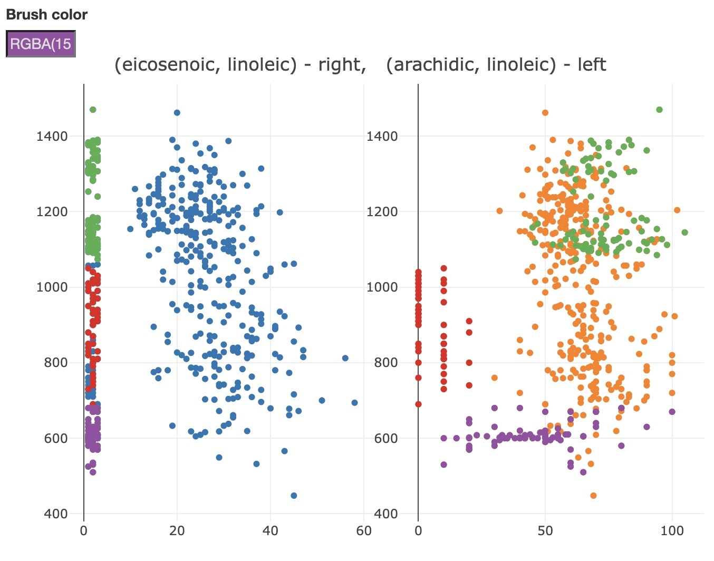

#### Statement Of Contribution
- Assignment 1: Shipeng Liu
- Assignment 2: Siyu Liu

```{r setup, include=FALSE}
knitr::opts_chunk$set(echo = TRUE)

library(tm)
library(readr)
library(tidyr)
library(dplyr)
library(plotly)
library(GGally)
library(ggplot2)
library(tidytext)
library(crosstalk)
library(wordcloud)
library(visNetwork)
library(RColorBrewer)
```

## Assignment 1
### 1. WordCloud

#### 1.1 Five wordcloud
```{r}
five<-read.table("Five.txt",header=F, sep='\n')
five$doc_id=1:nrow(five)
colnames(five)[1]=c("text")
five=five[,c(2,1)]


five_corpus <- VCorpus(DataframeSource(five))
#remove Punctuation
five_corpus <- tm_map(five_corpus, removePunctuation)
#remove numbers
five_corpus <- tm_map(five_corpus,removeNumbers)
#remove stop words
five_corpus <- tm_map(five_corpus,removeWords,stopwords(kind=c("en")))
tdm_five=TermDocumentMatrix(five_corpus)
m_five=as.matrix(tdm_five)

five_freq=sort(rowSums(m_five),decreasing=TRUE)
five_df=data.frame(word=names(five_freq),freq=five_freq)
pal <- brewer.pal(6,"Dark2")
pal <- pal[-(1)]

wordcloud(five_df$word,five_df$freq,scale=c(7,.4),min.freq=3,max.words=70,
          random.order=FALSE, random.color=TRUE,rot.per=.1,colors = pal,vfont=c("serif","plain"))

```

#### 1.2 OneTwo wordcloud
```{r}
onetwo<-read.table("OneTwo.txt",header=F, sep='\n')
onetwo$doc_id=1:nrow(onetwo)
colnames(onetwo)[1]=c("text")
onetwo=onetwo[,c(2,1)]


onetwo_corpus <- VCorpus(DataframeSource(onetwo))
#remove Punctuation
onetwo_corpus <- tm_map(onetwo_corpus, removePunctuation)
#remove numbers
onetwo_corpus <- tm_map(onetwo_corpus,removeNumbers)
#remove stop words
onetwo_corpus <- tm_map(onetwo_corpus,removeWords,stopwords(kind=c("en")))
tdm_onetwo=TermDocumentMatrix(onetwo_corpus)
m_onetwo=as.matrix(tdm_onetwo)

onetwo_freq=sort(rowSums(m_onetwo),decreasing=TRUE)
onetwo_df=data.frame(word=names(onetwo_freq),freq=onetwo_freq)
pal <- brewer.pal(6,"Dark2")
pal <- pal[-(1)]

wordcloud(onetwo_df$word,onetwo_df$freq,scale=c(7,.4),min.freq=3,max.words=70,
          random.order=FALSE, random.color=TRUE,rot.per=.1,colors = pal,vfont=c("serif","plain"))

```

In both Five.txt and OneTwo.txt,the word "Watch" are used most often.

### 2. TF-IDF
```{r,Warning=FALSE}
text_negative <- read_lines("OneTwo.txt")

text_frame_negative <- tibble(text = text_negative) %>%
  mutate(line = row_number())

tidy_frame_negative <- text_frame_negative %>% 
  unnest_tokens(word, text) %>%
  mutate(line = floor(line/10)) %>%
  count(line, word, sort = TRUE)

TF_IDF <- tidy_frame_negative %>%
  bind_tf_idf(word, line, n)

words <- TF_IDF$word
words <- words[!duplicated(words)]

mean_frame <- data.frame()
for (word in words) {
  mean_value <- mean(TF_IDF[TF_IDF$word == word, ]$tf_idf)
  mean_frame <- rbind(mean_frame, c(word, mean_value))
}
colnames(mean_frame) <- c("word", "mean_tf_idf")
mean_frame$mean_tf_idf <- as.numeric(mean_frame$mean_tf_idf)

mean_frame %>%
  with(wordcloud(word, mean_tf_idf, max.words = 200, colors = brewer.pal(6, "Dark2"), random.order = F))
```

When we look inside the `tidy_frame_negative` with a filter of `word == "watch"`, we can find that every group has this word, which make the IDF value of "watch" is zero. According to the TF-IDF algorithm, the TF-IDF value is equal to TF * IDF. So the TF-IDF value of "watch" is zero, even though the TF value of "watch" is large. The word cloud in Task 1 only consider the value of TF, so the word "watch" is not emphasized in TF-IDF diagram while it is emphasized in the previous word clouds.

### 3. Sentiment Analysis
```{r,Warning=FALSE,message=FALSE}
#3.1
five=read_lines("Five.txt")
onetwo=read_lines("OneTwo.txt")

fiveFrame=tibble(text=five)%>%mutate(line=row_number())
tidy_frame_five=fiveFrame%>%unnest_tokens(word, text)%>%
  left_join(get_sentiments("afinn"))%>%
  mutate(line1=floor(line/5))%>%
  group_by(line1, sort=TRUE)%>%
  summarize(Sentiment=sum(value, na.rm = T))

plot_ly(tidy_frame_five, x=~line1, y=~Sentiment)%>%add_bars()
```

```{r,Warning=FALSE,message=FALSE}
#3.2
onetwoFrame=tibble(text=onetwo)%>%mutate(line=row_number())
tidy_frame_onetwo=onetwoFrame%>%unnest_tokens(word, text)%>%
  left_join(get_sentiments("afinn"))%>%
  mutate(line1=floor(line/5))%>%
  group_by(line1, sort=TRUE)%>%
  summarize(Sentiment=sum(value, na.rm = T))

plot_ly(tidy_frame_onetwo, x=~line1, y=~Sentiment)%>%add_bars()

```

We could easily see in the text people give 5 stars,the sentiment values are all positive,But in the file OneTwo.txt,the sentiment values are not as high as them in Five.txt,there're even some negative sentiment values.So it shows a connection of the corresponding documents to  the kinds of reviews we expect to see.

### 4. Phrase net
```{r}
phraseNet=function(text, connectors){
  textFrame=tibble(text=paste(text, collapse=" "))
  tidy_frame3=textFrame%>%unnest_tokens(word, text, token="ngrams", n=3)
  tidy_frame3
  tidy_frame_sep=tidy_frame3%>%separate(word, c("word1", "word2", "word3"), sep=" ")

  tidy_frame_filtered=tidy_frame_sep%>%
    filter(word2 %in% connectors)%>%
    filter(!word1 %in% stop_words$word)%>%
    filter(!word3 %in% stop_words$word)
  tidy_frame_filtered

  edges=tidy_frame_filtered%>%count(word1,word3, sort = T)%>%
    rename(from=word1, to=word3, width=n)%>%
    mutate(arrows="to")

  right_words=edges%>%count(word=to, wt=width)
  left_words=edges%>%count(word=from, wt=width)

  nodes=left_words%>%full_join(right_words, by="word", values_fill = 0)%>%
    replace_na(list(n.x=0, n.y=0))%>%
    mutate(n.total=n.x+n.y)%>%
    mutate(n.out=n.x-n.y)%>%
    mutate(id=word, color=brewer.pal(9, "Blues")[cut_interval(n.out,9)],  font.size=40)%>%
    rename(label=word, value=n.total)

  edges=edges%>%left_join(nodes, c("from"= "id"))%>%
    left_join(nodes, c("to"="id"))%>%
    filter(value.x>1|value.y>1)%>%select(from,to,width,arrows)

  nodes=nodes%>%filter(id %in% edges$from |id %in% edges$to )

  visNetwork(nodes,edges)

}

```

#### 4.1 phrase nets for Five.Txt with connector words am, is, are, was, were
```{r}
phraseNet(five, c("is", "are","am","was","were"))
```

#### 4.2 phrase nets for Five.Txt with connector word at
```{r}
phraseNet(five, c("at"))
```

#### 4.3 phrase nets for OneTwo.Txt with connector words am, is, are, was, were
```{r}
phraseNet(onetwo, c("is", "are","am","was","were"))
```

#### 4.4 phrase nets for OneTwo.Txt with connector word at
```{r}
phraseNet(onetwo, c("at"))
```

### 5. Findings

Q1: Which properties of this watch are mentioned mostly often? 

  1.Cheap and durable
  
  2.Accurate
  
  3.water resistant
  
  4.Looks like classic dive watch
  
  5.Big and comfortable to wear
  
Q2: What are satisfied customers talking about?

  1.Accurate,time is exact(But a negative comment:4 sec slow)
  
  2.Durable,water resistant
  
  3.At a great price,cheaper
  
  4.huge,big enough
  
```{r,message=FALSE}

```

Q3: What are unsatisfied customers talking about?

  1.The analog part
  
  2.Battery issue,it stops
  
  3.Randomly slow,lousy at keeping accurate time
  
  4.Alarm is unusable
  
```{r,message=FALSE}

```

Q4: What are properties of the watch mentioned by both groups?

  1.Cheap
  
  2.Durable
  
  3.Waterproof
  
  4.The problem of alarm
  
  5.The analog issue
  
Q5: Can you understand watch characteristics (like size of display, features of the watches) by observing these graphs?

  Undoubtly we can understand some characteristics of the watch like,it's material is durable,glow at night,the size of it is big,display is easy(or blank,useless),by observing these graphs.
  
```{r, include=TRUE, fig.align="center", fig.cap=c("Fig 2.2.1 - Screenshot after burshing"), echo=FALSE}

```

## Assignment 2

### 1. Interactive scatter plot
```{r}
olive <- read.csv("olive.csv")
olive$X <- NULL

p2_1 <- olive %>%
  plot_ly(x = ~eicosenoic, y = ~linoleic) %>%
  add_markers()
p2_1
```

From the plot we can find that the values of eicosenoic of observations having unusually low values of eicosenoic are between 1 and 3.

### 2. Scatter plot and bar chart
```{r message=FALSE}
olive_shared <- SharedData$new(olive)

p2_2_1 <- olive_shared %>%
  plot_ly(x = ~eicosenoic, y = ~linoleic) %>%
  add_markers()

p2_2_2 <- olive_shared %>%
  plot_ly(x = ~as.factor(Region)) %>%
  add_histogram() %>%
  layout(barmode = "overlay", xaxis = list(title = "Region"))

p2_2 <- subplot(p2_2_1, p2_2_2) %>%
  highlight(on = "plotly_select", dynamic = T, persistent = T, opacityDim = I(1)) %>%
  hide_legend()

bscols(widths=c(2, NA), filter_slider("stearic", "stearic", olive_shared, ~stearic), p2_2)
```
```{r, include=TRUE, fig.align="center", fig.cap=c("Fig 2.2.1 - Screenshot after burshing"), echo=FALSE}

```

It is distinct that region 1 and 2 contain all observations of unusually low values of eicosenoic after brushing. By using slider, we can find region 1 has the widest range of value of stearic by slide left thumb to max value and slide right thumb to min value.

In this plot, brushing is a selection + connection operator and the slider is a filtering operator.

### 3. Linked scatter plots
```{r message=FALSE}
p2_3_1 <- olive_shared %>%
  plot_ly(x = ~eicosenoic, y = ~linoleic) %>%
  add_markers()

p2_3_2 <- olive_shared %>%
  plot_ly(x = ~arachidic, y = ~linoleic) %>%
  add_markers()

p2_3 <- subplot(p2_3_1, p2_3_2) %>%
  layout(title = "(eicosenoic, linoleic) - right,  (arachidic, linoleic) - left") %>%
  highlight(on = "plotly_select", dynamic = T, persistent = T, opacityDim = I(1)) %>%
  hide_legend()
p2_3
```
```{r, out.width="670", include=TRUE, fig.align="center", fig.cap=c("Fig 2.3.1 - Screenshot after burshing"), echo=FALSE}

```

From the screenshot we can see that red cluster and part of purple cluster are outliers in both two plots.

In the (eicosenoic, linoleic) plot, outliers on the left grouped by three colors and reflected in the (arachidic, linoleic) plot, red and purple group are still outliers but the green is one no more a outlier.

We also can find that inside the green and purple groups, there are large gaps of the value of arachidic when they are in same range of eicosenoic, and in the red group this difference is small.

### 4. Parallel coordinate plot, 3d-scatter plot and bar chart
```{r eval=FALSE}
p_parcoord <- shared1 %>%
  plot_ly(x = ~variable, y = ~value) %>%
  add_lines(line = list(width = 0.3)) %>%
  add_markers(marker = list(size = 3), text = ~.ID, hoverinfo = "text")

p_scatter_3d <- shared2 %>% 
  plot_ly(x = ~eicosenoic, y = ~linoleic, z = ~oleic) %>%
  add_markers() %>%
  layout(
    title = "Oilive",
    updatemenus = list(
      list(y=0.9, buttons = gen_dropdown_buttons("x")),
      list(y=0.8, buttons = gen_dropdown_buttons("y")),
      list(y=0.7, buttons = gen_dropdown_buttons("z"))
    )
  )

p_bar <- shared3 %>%
  plot_ly(x = ~as.factor(Region)) %>%
  add_histogram() %>%
  layout(barmode = "overlay")

p2_4 <- bscols(
  p_parcoord %>% 
    highlight(on="plotly_select", dynamic=T, persistent = T, opacityDim = I(1)) %>%
    hide_legend(),
  p_scatter_3d %>%
    highlight(on="plotly_click", dynamic=T, persistent = T) %>%
    hide_legend(),
  p_bar %>% 
    highlight(on="plotly_select", dynamic=T, persistent = T, opacityDim = I(1)) %>%
    hide_legend()
  )
p2_4
```
```{r, out.width="670", include=TRUE, fig.align="center", fig.cap=c("Fig 2.4.1 - Parcoord plot"), echo=FALSE}

```
```{r, out.width="670", include=TRUE, fig.align="center", fig.cap=c("Fig 2.4.2 - Scatter 3d plot"), echo=FALSE}

```
```{r, out.width="670", include=TRUE, fig.align="center", fig.cap=c("Fig 2.4.3 - Bar chart"), echo=FALSE}

```

We select eicosenoic, oleic and linoleic as the influential variables that can split data between regions and the brushing result is in Fig 2.4.2 and there are three clusters, each one belong to a region. The observations in region 2 (green group) has a cluster in the parcoord plot, but another two group are not very obvious.

### 5. Task 5

In the task 4, the link between three plots is connection operator, the drop down buttons are reconfiguring operators and brushing is a connection + selection operator, 3d-scatter plot has a navigation operator.

From Fig 2.4.2, we think the interaction operators used in task 4 is enough to make a distinction between different regions from the level of acids data, by using eicosenoic, oleic and linoleic as variables, even only eicosenoic and linoleic can also work. Firstly, if the level of eicosenoic is in the range of 1~3, this oil is come from region 2 or region 3. Then check the level of linoleic, if the value is larger than 1050, this oil come from region 2, otherwise from region 3.


## Appendix
### Codes For Assignment 1
```{r eval=FALSE}
library(tm)
library(tidytext)
library(dplyr)
library(tidyr)
library(readr)
library(wordcloud)
library(RColorBrewer)
library(ggplot2)
library(plotly)
library(visNetwork)


#1.1
five<-read.table("Five.txt",header=F, sep='\n')
five$doc_id=1:nrow(five)
colnames(five)[1]=c("text")
five=five[,c(2,1)]


five_corpus <- VCorpus(DataframeSource(five))
#remove Punctuation
five_corpus <- tm_map(five_corpus, removePunctuation)
#Convert all to lowercase
five_corpus <- tm_map(five_corpus,content_transformer(tolower))
#remove numbers
five_corpus <- tm_map(five_corpus,removeNumbers)
#remove stop words
five_corpus <- tm_map(five_corpus,removeWords,stopwords(kind=c("en")))
tdm_five=TermDocumentMatrix(five_corpus)
m_five=as.matrix(tdm_five)

five_freq=sort(rowSums(m_five),decreasing=TRUE)
five_df=data.frame(word=names(five_freq),freq=five_freq)
pal <- brewer.pal(6,"Dark2")
pal <- pal[-(1)]

wordcloud(five_df$word,five_df$freq,scale=c(7,.4),min.freq=3,max.words=70,
          random.order=FALSE, random.color=TRUE,rot.per=.1,colors = pal,vfont=c("serif","plain"))

#1.2
onetwo<-read.table("OneTwo.txt",header=F, sep='\n')
onetwo$doc_id=1:nrow(onetwo)
colnames(onetwo)[1]=c("text")
onetwo=onetwo[,c(2,1)]


onetwo_corpus <- VCorpus(DataframeSource(onetwo))
#remove Punctuation
onetwo_corpus <- tm_map(onetwo_corpus, removePunctuation)
#Convert all to lowercase
onetwo_corpus <- tm_map(onetwo_corpus,content_transformer(tolower))
#remove numbers
onetwo_corpus <- tm_map(onetwo_corpus,removeNumbers)
#remove stop words
onetwo_corpus <- tm_map(onetwo_corpus,removeWords,stopwords(kind=c("en")))
tdm_onetwo=TermDocumentMatrix(onetwo_corpus)
m_onetwo=as.matrix(tdm_onetwo)

onetwo_freq=sort(rowSums(m_onetwo),decreasing=TRUE)
onetwo_df=data.frame(word=names(onetwo_freq),freq=onetwo_freq)
pal <- brewer.pal(6,"Dark2")
pal <- pal[-(1)]

wordcloud(onetwo_df$word,onetwo_df$freq,scale=c(7,.4),min.freq=3,max.words=70,
          random.order=FALSE, random.color=TRUE,rot.per=.1,colors = pal,vfont=c("serif","plain"))

#In both Five.txt and OneTwo.txt,the word "Watch" are used most often.


#2.TF-IDF
text_negative <- read_lines("OneTwo.txt")
text_frame_negative <- tibble(text = text_negative) %>%
  mutate(line = row_number())
TF_IDF <- text_frame_negative %>%
  bind_tf_idf(word, line, n)
words <- TF_IDF$word
words <- words[!duplicated(words)]
mean_frame <- data.frame()
for (word in words) {
  mean_value <- mean(TF_IDF[TF_IDF$word == word, ]$tf_idf)
  mean_frame <- rbind(mean_frame, c(word, mean_value))
}
colnames(mean_frame) <- c("word", "mean_tf_idf")
mean_frame$mean_tf_idf <- as.numeric(mean_frame$mean_tf_idf)
mean_frame %>%
  with(wordcloud(word, mean_tf_idf, max.words = 200, colors = brewer.pal(6, "Dark2"), random.order = F))


#3.1
five=read_lines("Five.txt")
onetwo=read_lines("OneTwo.txt")

fiveFrame=tibble(text=five)%>%mutate(line=row_number())
tidy_frame_five=fiveFrame%>%unnest_tokens(word, text)%>%
  left_join(get_sentiments("afinn"))%>%
  mutate(line1=floor(line/5))%>%
  group_by(line1, sort=TRUE)%>%
  summarize(Sentiment=sum(value, na.rm = T))

plot_ly(tidy_frame_five, x=~line1, y=~Sentiment)%>%add_bars()

#3.2
onetwoFrame=tibble(text=onetwo)%>%mutate(line=row_number())
tidy_frame_onetwo=onetwoFrame%>%unnest_tokens(word, text)%>%
  left_join(get_sentiments("afinn"))%>%
  mutate(line1=floor(line/5))%>%
  group_by(line1, sort=TRUE)%>%
  summarize(Sentiment=sum(value, na.rm = T))

plot_ly(tidy_frame_onetwo, x=~line1, y=~Sentiment)%>%add_bars()


#4
phraseNet=function(text, connectors){
  textFrame=tibble(text=paste(text, collapse=" "))
  tidy_frame3=textFrame%>%unnest_tokens(word, text, token="ngrams", n=3)
  tidy_frame3
  tidy_frame_sep=tidy_frame3%>%separate(word, c("word1", "word2", "word3"), sep=" ")

  tidy_frame_filtered=tidy_frame_sep%>%
    filter(word2 %in% connectors)%>%
    filter(!word1 %in% stop_words$word)%>%
    filter(!word3 %in% stop_words$word)
  tidy_frame_filtered

  edges=tidy_frame_filtered%>%count(word1,word3, sort = T)%>%
    rename(from=word1, to=word3, width=n)%>%
    mutate(arrows="to")

  right_words=edges%>%count(word=to, wt=width)
  left_words=edges%>%count(word=from, wt=width)

  nodes=left_words%>%full_join(right_words, by="word", values_fill = 0)%>%
    replace_na(list(n.x=0, n.y=0))%>%
    mutate(n.total=n.x+n.y)%>%
    mutate(n.out=n.x-n.y)%>%
    mutate(id=word, color=brewer.pal(9, "Blues")[cut_interval(n.out,9)],  font.size=40)%>%
    rename(label=word, value=n.total)

  edges=edges%>%left_join(nodes, c("from"= "id"))%>%
    left_join(nodes, c("to"="id"))%>%
    filter(value.x>1|value.y>1)%>%select(from,to,width,arrows)

  nodes=nodes%>%filter(id %in% edges$from |id %in% edges$to )

  visNetwork(nodes,edges)

}


#phrase nets for Five.Txt with connector words am, is, are, was, were
phraseNet(five, c("is", "are","am","was","were"))
#phrase nets for Five.Txt with connector word at
phraseNet(five, c("at"))
#phrase nets for OneTwo.Txt with connector words am, is, are, was, were
phraseNet(onetwo, c("is", "are","am","was","were"))
#phrase nets for OneTwo.Txt with connector word at
phraseNet(onetwo, c("at"))


``` 

### Codes For Assignment 2
```{r eval=FALSE}
library(tidyr)
library(plotly)
library(GGally)
library(crosstalk)

# Task 1
olive <- read.csv("olive.csv")
olive$X <- NULL

olive_shared <- SharedData$new(olive)

p2_1 <- olive_shared %>%
  plot_ly(x = ~eicosenoic, y = ~linoleic) %>%
  add_markers()
p2_1

# Task 2
p2_2_bar <- olive_shared %>%
  plot_ly(x = ~as.factor(Region)) %>%
  add_histogram() %>%
  layout(barmode = "overlay", xaxis = list(title = "Region"))

p2_2 <- subplot(p2_1, p2_2_bar) %>%
  highlight(on = "plotly_select", dynamic = T, persistent = T, opacityDim = I(1)) %>%
  hide_legend()

bscols(widths=c(2, NA), filter_slider("stearic", "stearic", olive_shared, ~stearic), p2_2)

# Task 3
p2_3_1 <- olive_shared %>%
  plot_ly(x = ~eicosenoic, y = ~linoleic) %>%
  add_markers()

p2_3_2 <- olive_shared %>%
  plot_ly(x = ~arachidic, y = ~linoleic) %>%
  add_markers()

p2_3 <- subplot(p2_3_1, p2_3_2) %>%
  layout(title = "(eicosenoic, linoleic) - right,  (arachidic, linoleic) - left") %>%
  highlight(on = "plotly_select", dynamic = T, persistent = T, opacityDim = I(1)) %>%
  hide_legend()
p2_3

# Task 4
gen_dropdown_buttons <- function(axis) {
  buttons <- list()
  for (i in 3:10){
    buttons[[i-2]] <- list(
      method = "restyle",
      args = list(axis, list(olive[[i]])),
      label = colnames(olive)[i]
    )
  }
  return(buttons)
}

parcoord <- ggparcoord(olive, columns = c(3:10))
parcoord_data <- plotly_data(ggplotly(parcoord))
parcoord_data <- parcoord_data %>% group_by(.ID)

shared1 <- SharedData$new(parcoord_data, key = ~.ID, group = "olive")
p_parcoord <- shared1 %>%
  plot_ly(x = ~variable, y = ~value) %>%
  add_lines(line = list(width = 0.3)) %>%
  add_markers(marker = list(size = 3), text = ~.ID, hoverinfo = "text")

olive2 <- olive
olive2$.ID <- 1:nrow(olive)
shared2 <- SharedData$new(olive2, key = ~.ID, group = "olive")
p_scatter_3d <- shared2 %>% 
  plot_ly(x = ~eicosenoic, y = ~linoleic, z = ~oleic) %>%
  add_markers() %>%
  layout(
    title = "Oilive",
    updatemenus = list(
      list(y=0.9, buttons = gen_dropdown_buttons("x")),
      list(y=0.8, buttons = gen_dropdown_buttons("y")),
      list(y=0.7, buttons = gen_dropdown_buttons("z"))
    )
  )

olive3 <- olive
olive3$.ID <- 1:nrow(olive)
shared3 <- SharedData$new(olive3, key = ~.ID, group = "olive")
p_bar <- shared3 %>%
  plot_ly(x = ~as.factor(Region)) %>%
  add_histogram() %>%
  layout(barmode = "overlay")

p2_4 <- bscols(
  p_parcoord %>% 
    highlight(on="plotly_select", dynamic=T, persistent = T, opacityDim = I(1)) %>%
    hide_legend(),
  p_scatter_3d %>%
    highlight(on="plotly_click", dynamic=T, persistent = T) %>%
    hide_legend(),
  p_bar %>% 
    highlight(on="plotly_select", dynamic=T, persistent = T, opacityDim = I(1)) %>%
    hide_legend()
  )
p2_4
```
